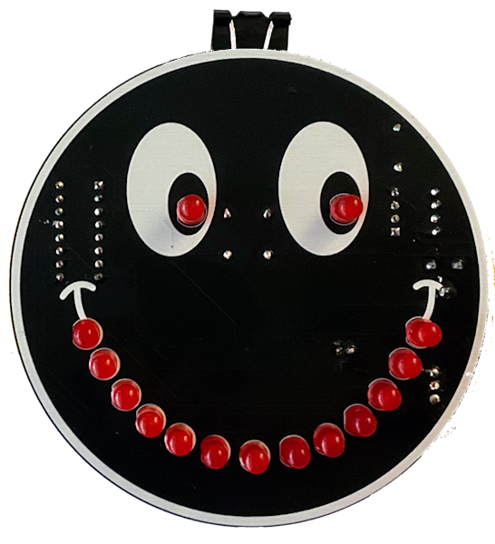

|[:skull:ISSUE](https://github.com/frankyhub/KiCad-Smiley/issues?q=is%3Aissue)|[:speech_balloon: Forum /Discussion](https://github.com/frankyhub/KiCad-Smiley/discussions)|[:grey_question:WiKi](https://github.com/frankyhub/KiCad-Smiley/wiki)||
|--|--|--|--|
| | | | |
||<a href="https://github.com/frankyhub/KiCad-Smiley/issues">|<a href="https://github.com/frankyhub/KiCad-Smiley/discussions">|<a href="https://github.com/frankyhub/KiCad-Smiley/releases">|
|| <a href="https://github.com/frankyhub/KiCad-Smiley/pulse" alt="Activity">| <a href="https://github.com/frankyhub/KiCad-Smiley/graphs/traffic">  |<a href="https://github.com/frankyhub?tab=stars"> |

## Smiley

  

### BOM

| Anzahl | Bezeichnung | 
| -------- | -------- | 
|  1 |   NE555 |
| 1  |  CD4017|
| 15  |  LED rt  |
| 1  | 10uF   |
|  2 |  100R  |
| 1  | 1,2k   |
| 1  | 100k Trimmer   |
| 1  | Microschalter   |
| 2  | Batterieclipps   |
| 2  |  CR2032  |
| 1  |  Foldback-Klammern 15mm  |
| -------- | -------- | 

---

   
<ol class="breadcrumb" style="border-top: 2px solid black;border-bottom:2px solid black; height: 45px; width: 900px;"> 
<a href="#oben">nach oben</a>
</ol>

  

---
